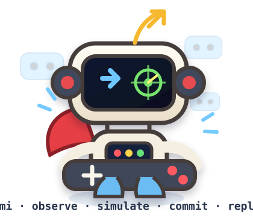

<p align="center">
  
</p>

<h1 align="center">Fami Pixel</h1>

<p align="center">
  <strong>Deterministic machine-control research for Famicom / NES games</strong>
</p>

<p align="center">
  <strong>Observe. Simulate. Commit. Replan.</strong>
</p>

<p align="center">
  <em>See the pixels. Simulate the future. Don't fall in the same pit twice.</em>
</p>

> Let Python see the game, understand the world, and control the player.

The first workload is **Super Mario Bros.** running on **Mesen CE**. Fami Pixel uses native emulator state, direct controller input, deterministic frame stepping, save-state branching, and evidence-driven planning without modifying the game ROM.

## Meet Fami

**Fami** is the fami-pixel mascot: a playful retro-game scout that treats every failure as another rollout to learn from.

| Trait | Fami |
|---|---|
| Personality | Mischievous, competitive, observant, and perfectly willing to turn a failed run into a joke |
| Interests | Retro games, platformers, RL, radar, game AI, save-state futures |
| Special move | Look at the live scene, simulate multiple futures, then commit to the one that actually survives |
| Favorite battle cry | `One more rollout!` / `Mesen says NO.` / `XDDDDD` |
| Zodiac | **Sagittarius** |
| Natural enemies | stale plans, `UNKNOWN == SAFE`, and dying in the same pit twice |

> **"I've seen eight futures. Seven end in a pit. Let's take the eighth." — Fami**

## Current milestone

On **2026-09-16**, the V26 controller autonomously completed **Super Mario Bros. World 1-1** from the opening state through the flagpole.

The validated run combined:

- native Mesen RAM / game-state observation;
- enemy, terrain, landing-zone, and reward semantics;
- scene-driven survival arbitration;
- exact Mesen save-state shadow rollouts;
- short-prefix receding-horizon execution;
- live power-up interception, including authoritative Star collection;
- per-run timeline, framebuffer, radar, and terminal evidence.

<p align="center">
  
</p>

<p align="center"><em>V26 autonomous World 1-1 completion — final flagpole / castle frame.</em></p>

## Authority model

**Mesen is the transition authority.** Python interprets state, proposes objectives and candidate actions, and evaluates alternatives, but direct emulator evidence wins over heuristics or learned estimates.

```text
Authoritative Mesen state
        |
        v
SMB1 semantic perception
  - Mario state / capability
  - enemies / clusters
  - terrain / gaps
  - landing-zone hazards
  - rewards
        |
        v
Objective arbitration
  SURVIVE > COLLECT > PROGRESS
        |
        v
Candidate action chunks
        |
        +--> cheap learned ordering / heuristics
        |
        v
Parallel Mesen save-state branches
        |
        v
Event-based trajectory evaluation
        |
        v
Execute a short prefix
        |
        +----> observe authoritative state and replan
```

The controller does not assume that a stale prediction is still true after the live emulator has moved. Current scene evidence can preempt asynchronous planning when survival requires it.

## Focus

- Windows
- Mesen CE native interop
- Python control / research layer
- Native framebuffer access
- RAM / PPU observation
- Direct NES controller override
- Deterministic frame stepping
- Save-state branching and replay
- Parallel shadow emulation
- Receding-horizon planning
- Structured run evidence and local Web UI

## Research modes

The environment supports three observation modes:

- **Vision-only** — native emulator framebuffer → model → action
- **State-only** — RAM / PPU state → semantic model / planner → action
- **Hybrid** — framebuffer + structured state → planner / model → action

This makes it possible to compare visual control against privileged emulator-state control while keeping the ROM unchanged.

## Planning model

The current SMB1 control stack separates four concerns:

1. **Perception** — decode the live scene from authoritative Mesen state.
2. **Objective selection** — decide whether the immediate priority is survival, collection, progress, or recovery.
3. **Forward search** — branch from exact save states and observe real emulator outcomes such as death, landing, reward collection, or level completion.
4. **Execution** — apply only a bounded prefix, then observe and plan again.

A tiny learned surrogate is available as a cheap ranking / pruning heuristic. It is not the final gameplay authority; exact Mesen outcomes remain authoritative.

## Evidence discipline

Narrow behavior is validated from deterministic save-state scenarios before another full-level integration run. Live runs persist enough evidence to reconstruct what the controller saw and why it acted:

- timeline records;
- final framebuffer;
- native Mario state;
- semantic radar;
- planner / objective metadata;
- trajectory-source age and result;
- terminal outcome.

The project follows a simple documentation rule:

> **README explains the system. Issues explain the journey. Code proves the current state.**

## Design notes

- [Forward-model trajectory planning](docs/architecture/forward-model-trajectory-planning.md) — outcome-oriented receding-horizon planning with Mesen as the exact forward model.
- [Reward-aware SMB1 planning](docs/architecture/reward-aware-planning.md) — separate hazard avoidance from state-dependent power-up pursuit while keeping Mesen authoritative.
- [SMB1 environment contract](docs/smb1-environment-contract.md) — game-specific observation and control semantics.
- [Mesen interop](docs/mesen-interop.md) — native emulator boundary used by the Python research layer.

## Design rule

Keep the emulator as the source of truth for machine state, keep Python as the experimentation layer, and keep game-specific semantics isolated from the generic NES environment.
